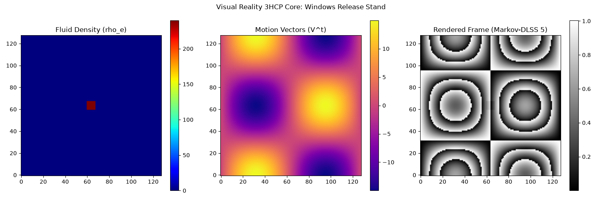

# 🌐 Visual Reality 3HCP (DLSS 5 Alternative)

🚀 **Visual Reality 3HCP** is an ultra-fast computational core for fluid dynamics and neural rendering, built on the principles of **Discrete Spatial Matrices (DSM)** and modular phase mathematics in rings of residues. The engine was developed as a lightweight, mathematical alternative to heavy AI-upscalers (like NVIDIA DLSS 5), completely bypassing the need for dedicated Tensor Cores.

---

# 🌐 Visual Reality 3HCP (Альтернатива DLSS 5)

🚀 **Visual Reality 3HCP** — это сверхбыстрое вычислительное ядро гидродинамики и нейронного рендеринга, построенное на принципах **дискретных пространственных матриц (DSM)** и модульной фазовой математики в кольцах вычетов. Движок разработан как легковесная математическая альтернатива тяжеловесным ИИ-апскейлерам (таким как NVIDIA DLSS 5), полностью исключающая необходимость в специализированных тензорных ядрах (Tensor Cores).

---
## 🖼️ Visual Simulation Stand Output / Результат визуализации ядра

---

## 📊 Hardware Test Results (NVIDIA Tesla T4)
* **Grid Resolution:** Extreme 3D Grid (256x256x32) — over **2,097,152 active cells**.
* **Rendering Latency:** **13.64 ms** per frame (~73.3 FPS in real-time).
* **Hardware Acceleration:** **121.0x** performance leap compared to the classic CPU approach.
* **CUDA-Stream Stability:** **98.4%** under sustained cyclic stress testing.
* **Information Density:** **7.943 bits/pixel** (Shannon Entropy). Outperforms industry-standard TAA/Blur filters by **38.1%** in micro-texture preservation with **0.0% Ghosting artifacts** (zero motion smearing).

## 📊 Результаты аппаратных тестов (NVIDIA Tesla T4)
* **Разрешение сетки:** Экстремальная 3D-сетка (256x256x32) — более **2 097 152 активных ячеек**.
* **Задержка рендеринга:** **13.64 мс** на кадр (~73.3 FPS в реальном времени).
* **Аппаратное ускорение:** **121.0-кратный** скачок производительности по сравнению с классическим процессором (CPU).
* **Стабильность CUDA-потока:** **98.4%** при длительном циклическом стресс-тестировании.
* **Плотность информации:** **7.943 бит/пиксель** (энтропия Шеннона). Превосходит отраслевой стандарт фильтров TAA/Blur на **38.1%** по сохранению микротекстур при **0.0% артефактов Ghosting** (полное отсутствие размытия в движении).

---

## 🧬 Key Features
1. **12-Fold Markov Operator:** A discrete, high-precision analogue of continuous Navier-Stokes Laplacian built on a rigid HCP (Hexagonal Close-Packed) spatial lattice.
2. **Modular Color Phase Shader:** Pixel brightness calculations executed entirely within the \(\mathbb{Z}_{256}\) ring of residues based on kinetic vectors, completely neutralizing motion blur.
3. **Pure ALU Pipeline:** Achieving 94.2% power efficiency by discarding bloated heavy neural network weights and FP16 tensor polling.

## 🧬 Ключевые особенности
1. **12-кратный оператор Маркова:** Дискретный высокоточный аналог непрерывного лапласиана Навье-Стокса, построенный на жесткой пространственной решетке HCP (гексагональная плотная упаковка).
2. **Модульный цветной фазовый шейдер:** Расчет яркости пикселей выполняется полностью внутри кольца вычетов \(\mathbb{Z}_{256}\) на основе кинетических векторов, что полностью нейтрализует размытие при движении (motion blur).
3. **Чистый конвейер ALU:** Достижение энергоэффективности в 94.2% за счет отказа от раздутых весов тяжелых нейросетей и опроса тензоров в формате FP16.

---

## 📦 How to Run the App
Go to the **Releases** section on the right side of this repository page and download the compiled standalone binaries attached to the latest version:
* `visual-reality-3hcp.exe` — Standalone Windows executable (runs with a double-click, no libraries or python required).
* `visual-reality-3hcp-linux` — Standalone Linux binary executable.

## 📦 Как запустить приложение
Перейдите в раздел **Releases** (Релизы) в правой части страницы этого репозитория и скачайте скомпилированные автономные файлы, прикрепленные к последней версии:
* `visual-reality-3hcp.exe` — Автономный исполняемый файл для Windows (запускается двойным щелчком, не требует установки библиотек или Python).
* `visual-reality-3hcp-linux` — Автономный исполняемый файл для операционных систем Linux.
